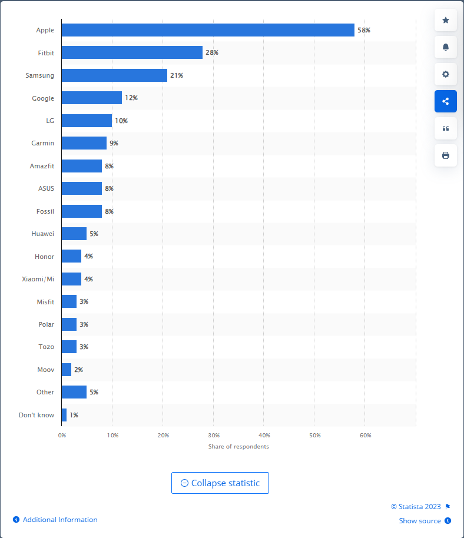

```{r setup, include=FALSE}
knitr::opts_chunk$set(echo = TRUE)
knitr::opts_knit$set(root.dir = "C:/Users/aagui/OneDrive/Cursos/Google Data Analysis/Proyecto/Data/DataverseNO")

```

------------------------------------------------------------------------

# Introducción

Análisis de oportunidades de crecimiento para la empresa Bellabeat, empresa de alta tecnología que fabrica productos inteligentes focalizados en el cuidado de la salud.

## Objetivos

-   Identificar el problema

-   Entender completamente las expectativas de los stakeholders

## Análisis

### Tendencias en el uso de dispositivos inteligentes

#### Most used eHealth tracker / smart watches by brand in the U.S. as of June 2023



Con un 58 por ciento, Apple es la marca más popular de relojes personales inteligentes y eHealth o rastreadores de actividad física entre los consumidores estadounidenses. En segundo lugar le sigue Fitbit con un 28 por ciento de los encuestados. Estos resultados se basan en una encuesta representativa en línea realizada en 2023 entre 3142 consumidores en los Estados Unidos.[@mostuse]

#### Number of users of fitness/activity tracking wristwear worldwide from 2018 to 2027


El número global de usuarios de pulseras de seguimiento de actividad/fitness en el segmento del mercado de la salud digital se pronosticaba que aumentaría continuamente entre 2023 y 2027 en un total de 84,7 millones de usuarios (+34,13 por ciento). Después del cuarto año consecutivo de aumento, el número de usuarios se estima que alcanzará los 332,84 millones de usuarios y por tanto un nuevo pico en 2027. En particular, el número de usuarios del sistema de seguimiento de actividad física de el segmento de pulseras del mercado de la salud digital fue continuamente aumentando en los últimos años.[@global:]

### Wearable sensors with possibilities for data exchange

Basado en un estudio realizado por el "Norwegian Centre for E-health Research, Tromsø, Norway" sobre sensores para el monitoreo de la salud e intercambio de datos [@muzny2020],

```{r}
library(tidyverse)
```


```{r}
wearable_sensors_df <- read.csv("Wearable_sensors_for_data_exchange.csv", sep = ";")

```

