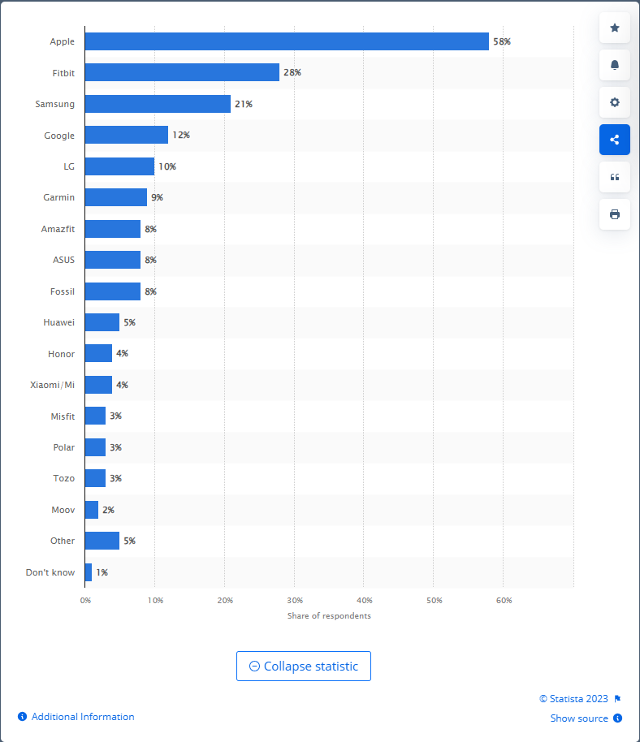
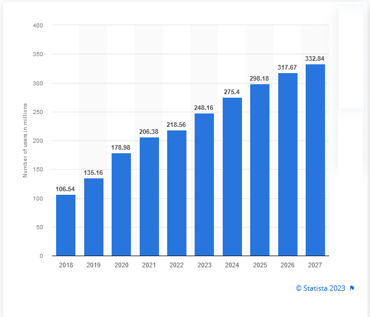

```{r setup, include=FALSE}
knitr::opts_chunk$set(echo = TRUE)
# knitr::opts_knit$set(root.dir = "C:/Users/aagui/Github/Proyecto_1_GDA/Bellabeat/Data/DataverseNO")

```

------------------------------------------------------------------------

# Introducción

Análisis de oportunidades de crecimiento para la empresa Bellabeat, empresa de alta tecnología que fabrica productos inteligentes focalizados en el cuidado de la salud.

## Objetivos

-   Identificar el problema

-   Entender completamente las expectativas de los stakeholders

## Acerca de la empresa

Nombre: Bellabeat

Stakeholders:

-   **Urška Sršen**: Cofundadora y directora creativa

-   **Sando Mur**: Cofundador y matemático

-   **Equipo de análisis computacional de datos de marketing de Bellabeat**: Equipo de analistas de marketing.

Productos:

-   **Aplicación Bellabeat:** La aplicación Bellabeat proporciona a los usuarios datos de salud relacionados con su actividad física, sueño, estrés, ciclo menstrual y hábitos de conciencia plena. Estos datos pueden ayudar a los usuarios a comprender sus hábitos actuales y adoptar decisiones saludables. La aplicación Bellabeat se conecta a su línea de productos de bienestar inteligentes.

-   **Leaf:** Dispositivo de seguimiento clásico de bienestar de Bellabeat que se puede usar como pulsera, collar o clip. El dispositivo Leaf se conecta a la aplicación Bellabeat para hacer un seguimiento de la actividad física, el sueño y el estrés.

-   **Time:** Este reloj de bienestar combina el aspecto intemporal de un reloj clásico con la tecnología inteligente para hacer el seguimiento de la actividad física, el sueño y el estrés del usuario. El reloj Time se conecta a la aplicación Bellabeat para proporcionar información sobre el bienestar diario.

-   **Spring:** Es una botella de agua que hace el seguimiento diario del consumo de agua mediante el uso de tecnología inteligente para garantizar la hidratación adecuada a lo largo del día. La botella Spring se conecta a la aplicación Bellabeat para hacer el seguimiento de los niveles de hidratación

-   **Membresía de Bellabeat:** Bellabeat también ofrece a los usuarios un programa de membresía mediante suscripción. La membresía brinda a los usuarios un acceso 24/7 a una orientación totalmente personalizada sobre nutrición, actividad física, sueño, salud y belleza y conciencia plena según el estilo de vida y las metas del usuario.

## Objetivos Identificados

-   Identificar el uso que dan los no-usuarios de Bellabeat a los dispositivos inteligentes.

-   Hacer una comparativa con un producto de Bellabeat.

-   Identificar oportunidades de crecimiento para la empresa.

-   Dar recomendaciones de alto nivel sobre como las tendencias descubiertas pueden colaborar en la estrategia de marketing.

## Análisis

### Tendencias en el uso de dispositivos inteligentes

#### Most used eHealth tracker / smart watches by brand in the U.S. as of June 2023



Con un 58 por ciento, Apple es la marca más popular de relojes personales inteligentes y eHealth o rastreadores de actividad física entre los consumidores estadounidenses. En segundo lugar le sigue Fitbit con un 28 por ciento de los encuestados. Estos resultados se basan en una encuesta representativa en línea realizada en 2023 entre 3142 consumidores en los Estados Unidos.[@mostuse]

#### Number of users of fitness/activity tracking wristwear worldwide from 2018 to 2027



El número global de usuarios de pulseras de seguimiento de actividad/fitness en el segmento del mercado de la salud digital se pronosticaba que aumentaría continuamente entre 2023 y 2027 en un total de 84,7 millones de usuarios (+34,13 por ciento). Después del cuarto año consecutivo de aumento, el número de usuarios se estima que alcanzará los 332,84 millones de usuarios y por tanto un nuevo pico en 2027. En particular, el número de usuarios del sistema de seguimiento de actividad física de el segmento de pulseras del mercado de la salud digital fue continuamente aumentando en los últimos años.[@global:]

### Wearable sensors with possibilities for data exchange

Basado en un estudio realizado por el "Norwegian Centre for E-health Research, Tromsø, Norway" sobre sensores para el monitoreo de la salud e intercambio de datos [@muzny2020],

```{r include=FALSE}
library(tidyverse)
```

Cargando el Dataset con la información de los sensores Wearables:

```{r warning=FALSE}
setwd("C:/Users/aagui/Github/Proyecto_1_GDA/Bellabeat/Data/DataverseNO")
wearable_sensors_df <- read.csv("Wearable_sensors_for_data_exchange.csv", sep = ";")

```

Revisando las columnas del Dataframe:

```{r}
head(wearable_sensors_df)
```

Un vistazo al Dataframe:

```{r}
glimpse(wearable_sensors_df)
```

#### Verificación de valores nulos

```{r}
# Verificar valores nulos en todo el dataframe
nulos <- is.na(wearable_sensors_df)

# Contar la cantidad de valores nulos por columna
sum(nulos)
```

El dataset no tiene valores nulos.

**¿Qué tipo de Wearables analizaron en el estudio?**

```{r}
wearable_sensors_df %>%
  count(Type.of.wearable.system) %>% 
  arrange(desc(n)) %>% 
  mutate(
    percentage = n / sum(n) * 100,
    percentage = round(percentage, 1),
    Type.of.wearable.system = reorder(Type.of.wearable.system, -n)  # Reordena las categorías
  )  %>% 
  ggplot(aes(x = Type.of.wearable.system, y = percentage)) +
  geom_bar(stat = "identity", fill = "blue") +
  geom_text(aes(label = percentage), hjust = 0.5, vjust = -0.2) +
  labs(title = "Porcentaje de sensores wearables por tipo", x = "Tipo de sensor wearable", y = "Porcentaje") +
  theme(axis.text.x = element_text(angle = 45, hjust = 0.5, vjust = 0.5))


```

Vemos que casi el 50% de los dispositivos analizados son del tipo Tracker(GPS) y cerca del 24% son del tipo Smartwatch, resaltando la oportunidad de BellaBeat con sus productos actuales dentro del segmento de mercado.

**¿Qué tipo de interfaces de comunicación utilizan estos dispositivos analizados?**

```{r}
dplyr::count(wearable_sensors_df, Communication.interfaces) %>% 
  arrange(desc(n)) %>% 
  slice_head(n = 10) %>% 
  mutate(
    percentage = n / sum(n) * 100,
    percentage = round(percentage, 1),
    Communication.iterfaces = reorder(Communication.interfaces, -n) #Reordena categorias
  ) %>% 
  ggplot(aes(x = Communication.interfaces, y = percentage)) +
  geom_bar(stat = "identity", fill = "blue") +
  geom_text(aes(label = percentage), hjust = 0.0, vjust = -0.2) +
  labs(title = "Percentage of communication interfaces used in werables", x = "Communication Interface", y = "Percentage") +
  theme(axis.text.x = element_text(angle = 90, hjust = 0.5, vjust = 0.5 ))
```

En este punto podemos observar la prevalecencia de Bluetooth como interface preferida por la mayoría de dispositivos y en concordancia con la configuración de nuestros dispositivos.

### Análisis del Dataset [**FitBit Fitness Tracker Data**](https://www.kaggle.com/datasets/arashnic/fitbit)

#### Acerca del Dataset

Este conjunto de datos generado por los encuestados de una encuesta distribuida a través de Amazon Mechanical Turk entre el 3 de diciembre de 2016 y el 5 de diciembre de 2016. Treinta usuarios elegibles de Fitbit dieron su consentimiento para el envío de datos de seguimiento personal, incluida la salida a nivel de minutos para actividad física, frecuencia cardíaca y monitoreo del sueño. Los informes individuales se pueden analizar por ID de sesión de exportación (columna A) o marca de tiempo (columna B). La variación entre los resultados representa el uso de diferentes tipos de rastreadores Fitbit y comportamientos/preferencias de seguimiento individuales.

```{r}
all_datasets = list.files(path="./Data/Fitabase Data 4.12.16-5.12.16", pattern = "*.csv", full.names = TRUE)
all_datasets
```

#### Recolección Data

```{r}
library("skimr")

# Crear un marco de datos con los datos de actividad diaria del usuario.
daily_activity_df <- read_csv(all_datasets[1], show_col_types = FALSE)

# Crear un marco de datos 
daily_calories_df <- read_csv(all_datasets[2])

# Explorando el dataset dailyActivity_merged
skim_without_charts(daily_activity_df)
```

```{r}
# Explorando el dataset dailyCalories_merged
skim_without_charts(daily_calories_df)
```

```{r}
# Número de participantes reportados en cada Dataset
n_distinct(daily_activity_df$Id)
n_distinct(daily_calories_df$Id)
```

```{r}

# Número de filas en cada Dataset
nrow(daily_activity_df)
nrow(daily_calories_df)
```

#### Limpieza Dataframe

```{r}
# Registros duplicados
sum(duplicated(daily_activity_df))
sum(duplicated(daily_calories_df))
```

```{r}
# Valores faltantes
sum(is.na(daily_activity_df))
sum(is.na(daily_calories_df))
```

```{r}
# Cambiamos los nombres de las columnas con fechas a "Date" en los 2 DF
colnames(daily_activity_df)[colnames(daily_activity_df) == "ActivityDate"] <- "Date"
colnames(daily_calories_df)[colnames(daily_calories_df) == "ActivityDay"] <-  "Date"
```

```{r}
# Colocamos formato de fecha a esas columnas
daily_activity_df$Date <- as.Date(daily_activity_df$Date, format='%m/%d/%Y')
daily_calories_df$Date <- as.Date(daily_calories_df$Date, format='%m/%d/%Y')
```

```{r}
# Identificamos el día de la semana en una nueva columna
daily_activity_df$Weekdays <- wday(daily_activity_df$Date, label=TRUE, abbr=FALSE)
daily_calories_df$weekdays <- wday(daily_calories_df$Date, label=TRUE, abbr=FALSE)

```

```{r}
# Calculamos el tiempo de actividad en una nueva columna
daily_activity_df <- daily_activity_df %>% 
  mutate(daily_activity_df, TotalActiveMinutes = VeryActiveMinutes + FairlyActiveMinutes + LightlyActiveMinutes)
```

#### Analizando el Dataframe

```{r}
print(paste("Número de personas observadas: ", n_distinct(daily_activity_df$Id)))
print(paste("Total de observaciones resgistradas: ", nrow(daily_activity_df)))
# búsqueda de registos con observación de calorias en 0:
cantidad_registros_calorias_zero <- daily_activity_df %>% 
  count(Calories == 0) %>% 
  arrange(n)
print(paste("Número de registros de calorias nulos: ", cantidad_registros_calorias_zero ))
```

Solo 4 registros presentan el registro de calorias en cero.

##### Buscando Outliers

```{r}
observation_number <- daily_activity_df %>% 
  count(Id) %>% 
  arrange(n)

ggplot(observation_number, aes(x=Id, y=n)) +
  geom_point() +
  ggtitle("Cantidad de entradas diarias por Id de usuario") +
  labs(x="ID Usuario", y="Número de entradas diarias") + 
  geom_hline(yintercept = 23, linetype="longdash", color="green") +
  theme(plot.title=element_text(size=10), text=element_text(size=10))

```

```{r}
# Capturamos los primeros 4 valores para eliminarlos de las tablas
outliers <- observation_number$Id[1:4]

```

```{r}
# Eliminamos outliers de los dos dataframes:
daily_activity_df <- subset(daily_activity_df, !(Id %in% outliers))
daily_calories_df <- subset(daily_calories_df, !(Id %in% outliers))

```

```{r}
# Cantidad de entradas en DF daily_Activity despues de remover outliers
nrow(daily_activity_df)
```

```{r}
# Cantidad de entradas en DF daily_Calories despues de remover outliers
nrow(daily_calories_df)
```

####  Resumen de actividad diaria (depues de limpieza)

```{r}
daily_activity_df %>% 
  select(TotalSteps,
         TotalDistance,
         Calories,
         VeryActiveMinutes,
         LightlyActiveMinutes) %>% 
  summary()
```

#### Resumen de actividad calóricas (despues de limpieza)

```{r}
daily_calories_df %>% 
  select(Id,
         Date,
         Calories,
         weekdays)
daily_calories_df
```

```{r}
ggplot(daily_activity_df, aes(x= TotalActiveMinutes, y= Calories)) +
  geom_point() +
  geom_smooth()+
  labs(title="Total de Actividad Diaria vs. Total calorias quemadas", x="Minutos Activos", y="Calorias Quemadas")+
  theme(plot.title = element_text(size=12), text=element_text(size=10, color='red', face='bold'))
```

Se evidencia una correlación positiva entre la actividad diaria y las calorias quemadas como es de esperar.

## Exposición de hallazgos

-   Apple lidera en Estados Unidos la venta de dispositivos electrónicos de control de salud (trackers y Smartwatcs) con un abrumador 58% y bastante lejos en segundo lugar, Fitbit y Samsung en tercer lugar con un 28 y 21 respectivamente. Dentro del estudio consultado la marca Bellabeat aparece dentro de la categoria de otros, que solo tienen un 5% del mercado, así que dentro del nicho de mujeres que maneja la empresa el potencial de crecimiento es positivo.
-   A nivel mundial el uso de dispositivos de tracking para actividad física y sensores de signos vitales está aumentando a un ritmo acelerado, lo cual coloca a Bellabeat, nuevamente dentro de su nicho de mujeres en una posición positiva de crecimiento.
-   Los wearables más usados son los Trackers y los Smartwatch que usan la interfaz bluetooth como medio de intercambio de información. Esto confirma la asertividad técnica dada a los equipos de Bellabeat y su congruencia con las interfaces de la marcas top.
-   Dado que se refuerza la correlación directa entre el ejercicio, las calorias quemadas y el beneficio de controlar las actividades se evidencia la disponibilidad de nicho para que Bellabeat pueda crecer de forma orgánica y no orgánica por los próximos 5 años.

## Recomendaciones 

1.  Ejecutar un plan de marketing más agresivo que implique el uso de Influencers, Deportistas y famosas dentro de los límites de presupuesto para posicionar la marca dentro nichos clave cómo deportistas, ejecutivas, fans de cantantes y actrices.

2.  Realizar eventos deportivos soportados por la marca y que se aseguren de crear el engagement necesario para expandir la marca de forma orgánica.

3.  Buscar asociaciones tácticas con empresas como gimnasios, bebidas y alimentos para deportistas y específicamente dentro del nicho de mujeres que cuidan su salud.
